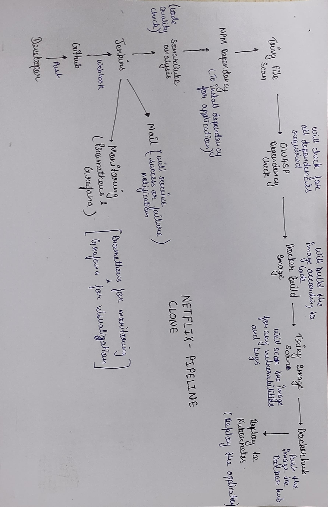
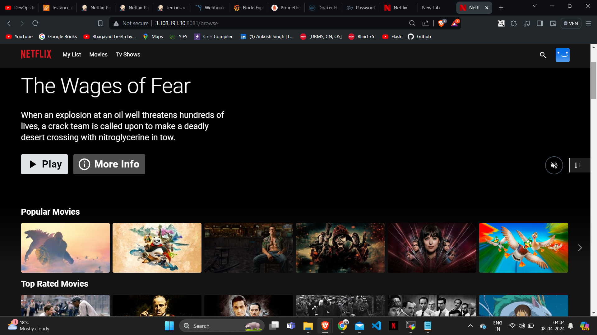

## Install the Prometheus Plugin and Integrate it with the Prometheus server

- Goto Manage Jenkins –> Plugins –> Available Plugins
  - Search for Prometheus and install it (Prometheus metrics)
- Once that is done you will Prometheus is set to /Prometheus path in system configurations
- Nothing to change click on apply and save
- To create a static target, you need to add job_name with static_configs. go to Prometheus server
  ```bash
  sudo vim /etc/prometheus/prometheus.yml
  ```
  Paste below code
  ```bash
  - job_name: 'jenkins'
    metrics_path: '/prometheus'
    static_configs:
      - targets: ['<jenkins-ip>:8080']
  ```
  

Before, restarting check if the config is valid.
  ```bash
  promtool check config /etc/prometheus/prometheus.yml
  ```
Then, you can use a POST request to reload the config.
  ```bash
  curl -X POST http://localhost:9090/-/reload
  ```
Check the targets section at: http://<ip>:9090/targets
- Let’s add Dashboard for a better view in Grafana
- Click On Dashboard –> + symbol –> Import Dashboard
- Use Id 9964 and click on load
- Select the data source and click on Import
- Now you will see the Detailed overview of Jenkins

## Email Integration With Jenkins and Plugin Setup
- Install Email Extension Plugin in Jenkins (Email Extension Template)
- Go to your Gmail and click on your profile.
- Then click on Manage Your Google Account –> click on the security tab on the left side panel you will get this page(provide mail password).
- 2-step verification should be enabled.
- Search for the app in the search bar you will get _app passwords_
- Click on other and provide your name and click on Generate and copy the password
- In the new update, you will get a password
- Once the plugin is installed in Jenkins, click on manage Jenkins –> configure system there under the E-mail Notification section configure the details.
- Tick use SMTP authentication provide id and generated password, also tick Use SSL.
- Click on Apply and save.
- Click on Manage Jenkins–> credentials and add your mail username and generated password.

## Install Plugins like JDK, Sonarqube Scanner, NodeJs, OWASP Dependency Check
Goto Manage Jenkins →Plugins → Available Plugins 
Install below plugins

1 → Eclipse Temurin Installer (Install without restart)
2 → SonarQube Scanner (Install without restart)
3 → NodeJs Plugin (Install Without restart)
JDK installations -> add JDK -> name: jdk17 -> install automatically (install from adoptium.net) -> select jdk-17.6.9+9
NodeJs -> add Nodes -> name: node16 -> install automatically (install from adoptium.net) -> select nodeJS 16.2.0

## Configure Sonar Server in Manage Jenkins
- Grab the Public IP Address of your EC2 Instance, Sonarqube works on Port 9000, so <Public IP>:9000. Goto your Sonarqube Server. Click on Administration → Security → Users → Click on Tokens and Update Token → Give it a name → and click on Generate Token
- click on update Token
- Create a token with a name and generate
- copy Token
- Goto Jenkins Dashboard → Manage Jenkins → Credentials → Add Secret Text
- ID: sonar-cred and Description: sonar-cred
- Dashboard → Manage Jenkins → System
- SonarQube server -> name: sonar-server, serverURL: <Paste URL> , Server Authentication token: sonar-cred.
- Click on Apply
- Manage Jenkins -> Tools -> SonarQube Scanner installations
- Name: sonar-scanner, Install automatically-> select a versio of your choice.
- In the Sonarqube Dashboard add a quality gate also -> Administration–> Configuration–> Webhooks-> Click on Create-> Add details (<http://jenkins-public-ip:8080>/sonarqube-webhook/)
    ```bash
  pipeline{
    agent any
    tools{
        jdk 'jdk17'
        nodejs 'node16'
    }
    environment {
        SCANNER_HOME=tool 'sonar-scanner'
    }
    stages {
        stage('clean workspace'){
            steps{
                cleanWs()
            }
        }
        stage('Checkout from Git'){
            steps{
                git branch: 'main', url: 'Your GIT REPO ADDRESS'
            }
        }
        stage("Sonarqube Analysis "){
            steps{
                withSonarQubeEnv('sonar-server') {
                    sh ''' $SCANNER_HOME/bin/sonar-scanner -Dsonar.projectName=Netflix \
                    -Dsonar.projectKey=Netflix '''
                }
            }
        }
        stage("quality gate"){
           steps {
                script {
                    waitForQualityGate abortPipeline: false, credentialsId: 'Sonar-token'
                }
            }
        }
        stage('Install Dependencies') {
            steps {
                sh "npm install"
            }
        }
    }
    post {
     always {
        emailext attachLog: true,
            subject: "'${currentBuild.result}'",
            body: "Project: ${env.JOB_NAME}<br/>" +
                "Build Number: ${env.BUILD_NUMBER}<br/>" +
                "URL: ${env.BUILD_URL}<br/>",
            to: 'postbox.aj99@gmail.com',
            attachmentsPattern: 'trivyfs.txt,trivyimage.txt'
        }
    }
}


## Install OWASP Dependency Check Plugins
- GotoDashboard → Manage Jenkins → Plugins → OWASP Dependency-Check. Click on it and install it without restart.
- Goto Dashboard → Manage Jenkins → Tools → name:DC -> Install Automatically (Choose version of your choice)
- Click on Apply and Save here.
 
```bash
  stage('OWASP FS SCAN') {
            steps {
                dependencyCheck additionalArguments: '--scan ./ --disableYarnAudit --disableNodeAudit', odcInstallation: 'DC'
                dependencyCheckPublisher pattern: '**/dependency-check-report.xml'
            }
        }
        stage('TRIVY FS SCAN') {
            steps {
                sh "trivy fs . > trivyfs.txt"
            }
        }
  ```
## Docker Image Build and Push
We need to install the Docker tool in our system, Goto Dashboard → Manage Plugins → Available plugins → Search for Docker and install these plugins
Docker
Docker Commons
Docker Pipeline
Docker API
docker-build-step
and click on install without restart

- Now, goto Dashboard → Manage Jenkins → Tools → Docker INstallation -> name: docker -> Install Automatically -> version:latest.
Add DockerHub Username and Password under Global Credentials
- kind: username and password -> scope: global -> username: DockerHUb username -> password: DockerHub password -> ID: docker-cred -> Description: docker-cred.

  ```bash
  stage("Docker Build & Push"){
            steps{
                script{
                   withDockerRegistry(credentialsId: 'docker-cred', toolName: 'docker'){
                       sh "docker build --build-arg TMDB_V3_API_KEY=_your API -t netflix ."
                       sh "docker tag netflix aankusshhh/netflix:latest "
                       sh "docker push aankusshhh/netflix:latest "
                    }
                }
            }
        }
        stage("TRIVY"){
            steps{
                sh "trivy image aankusshhh/netflix:latest > trivyimage.txt"
            }
        }
  ```

  Now Run the container to see if the game coming up or not by adding the below stage
  ```bash
  stage('Deploy to container'){
            steps{
                sh 'docker run -d --name netflix -p 8081:80 aankusshhh/netflix:latest'
            }
        }
  ```

  <Jenkins-public-ip:8081>

  

  


  # Full Pipeline
  ```bash
  pipeline{
    agent any
    tools{
        jdk 'jdk17'
        nodejs 'node16'
    }
    environment {
        SCANNER_HOME=tool 'sonar-scanner'
    }
    stages {
        stage('Clean workspace'){
            steps{
                cleanWs()
            }
        }
        stage('Checkout from Git'){
            steps{
                git branch: 'main', url: 'https://github.com/aankusshh/Netflix-clone.git'
            }
        }
        stage("Sonarqube Analysis "){
            steps{
                withSonarQubeEnv('sonar-server') {
                    sh ''' $SCANNER_HOME/bin/sonar-scanner -Dsonar.projectName=Netflix \
                    -Dsonar.projectKey=Netflix '''
                }
            }
        }
        stage("Quality gate"){
           steps {
                script {
                    waitForQualityGate abortPipeline: false, credentialsId: 'sonar-cred'
                }
            }
        }
        stage('Install Dependencies') {
            steps {
                sh "npm install"
            }
        }
        
        stage('OWASP FS SCAN') {
            steps {
                dependencyCheck additionalArguments: '--scan ./ --disableYarnAudit --disableNodeAudit', odcInstallation: 'DC'
                dependencyCheckPublisher pattern: '**/dependency-check-report.xml'
            }
        }
        stage('TRIVY FS SCAN') {
            steps {
                sh "trivy fs . > trivyfs.txt"
            }
        }
        
        stage("Docker Build & Push"){
            steps{
                script{
                   withDockerRegistry(credentialsId: 'docker-cred', toolName: 'docker'){
                       sh "docker build --build-arg TMDB_V3_API_KEY=e79eaf017d4841bc101ab156988543ce -t netflix ."
                       sh "docker tag netflix aankusshhh/netflix:latest "
                       sh "docker push aankusshhh/netflix:latest "
                    }
                }
            }
        }
        stage("TRIVY"){
            steps{
                sh "trivy image aankusshhh/netflix:latest > trivyimage.txt"
            }
        }
        stage('Deploy to container'){
            steps{
                sh 'docker rm -f netflix'
                sh 'docker run -d --name netflix -p 8081:80 aankusshhh/netflix:latest'
            }
        }
        stage('Deploy to kubernets'){
            steps{
                script{
                    dir('Kubernetes') {
                        withKubeConfig(caCertificate: '', clusterName: '', contextName: '', credentialsId: 'k8s', namespace: '', restrictKubeConfigAccess: false, serverUrl: 'https://172.31.38.16:6443') {
                                sh 'kubectl apply -f deployment.yml'
                                sh 'kubectl apply -f service.yml'
                        }
                    }
                }
            }
        }
        
        
    }
    post {
     always {
        emailext attachLog: true,
            subject: "'${currentBuild.result}'",
            body: "Project: ${env.JOB_NAME}<br/>" +
                "Build Number: ${env.BUILD_NUMBER}<br/>" +
                "URL: ${env.BUILD_URL}<br/>",
            to: 'ankush56singh@gmail.com',
            attachmentsPattern: 'trivyfs.txt,trivyimage.txt'
        }
    }
  }
 ```

