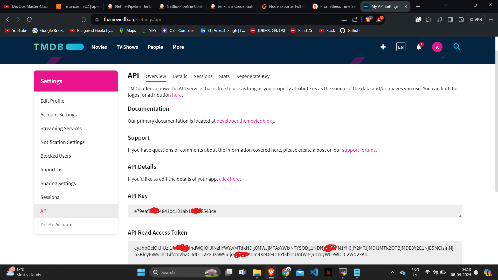

# Phase 1
Create and set Up 4 EC2 instances:
1. Jenkins [Click Here](https://github.com/aankusshh/Netflix-clone--Pipeline/blob/main/Jenkins%20Server%20Setup.md) for stepwise setup of server.
2. Monitoring (For Set up ) 
3. Kubernetes - Master (For Set up )
4. Kubernetes - Slave (For Set up )
   
# Phase 2
Create a TMDB API Key:
### STEPS:
1. Open a new tab in the Browser and search for TMDB
2. Click on the Login on the top right.
3. You need to create an account here.
4. Let’s create an API key, By clicking on your profile and clicking settings.
5. Now click on API from the left side panel.
6. Now click on create
7. Click on Developer
8. Now you have to accept the terms and conditions.
9. Provide basic details (Application Summary must contain more tha 100 words)
10. Click on submit and you will get your API key.

# Phase 3
# Phase 4
